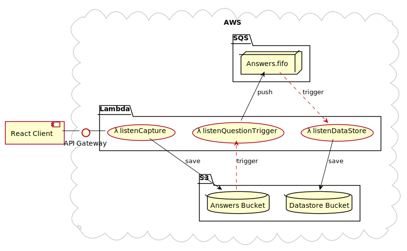

**[Back to README](./README.md)**

---

# Architecture

As part of gathering an understanding of the broad view of the project, I drew a simple architecture diagram by hand (which I've included below in the form of a plantuml diagram)

The entire architecture aims to be both serverless and database free. I think, on balance, this makes sense as it keeps the overhead very low and data-transfer and storage costs are likely less compared to hosting something like Postgres on AWS RDS.

## Client Side

A simple React app, bootstrapped with `create-react-app`, runs the quiz and performs an HTTP `POST` with the results to the `listenCapture` lamdba function via API Gateway.

## Lambdas

- `listenCapture` lambda, takes the initial payload and stores it in S3
- `listenQuestionTrigger` is triggered by a `PutObject` event in the answers S3 bucket and adds a message to the SQS queue
- `listenDataStore` is triggered by the SQS FIFO queue and reformats the data before storing it in the datastore bucket

## SQS

SQS is used to manage the FIFO queue and triggers the `listenDataStore` lambda function

## S3

Answer data and reformatted quiz data is stored in strucuted folders inside two S3 buckets as JSON.

## Other

As part of the deployment, several IAM roles are created by CloudFormation to allow access to individual components, which have not been detailed in the diagram above for simplicity.

---

**[Next - Decisions](./02_DECISIONS.md)**
